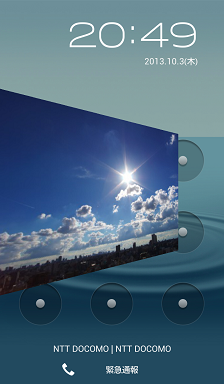
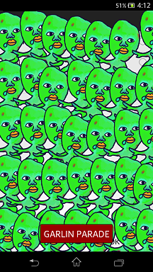

CutIn Material
---

What is CutIn? It is effects on your phone, like in games but not in games.

  

CutIn Material is based on [CutIn Manager](https://play.google.com/store/apps/details?id=com.garlicg.cutin) app. CutIn Manger call CutIn Materials at the follow cases:

 * Screen turns on.
 * External power is connected.
 * Wired headset plugged
 * The date changed
 * Indicated low battery condition
 
If you have made an Material app , please message me. CutIn Manager has own random advertising area for CutIn Materials. It is free and will promote your apps.

GarlicG : garlicg@gmail.com

Directory
---
| name | description |
|---|---|
| cutin-connector.jar | A core library for interaction with CutinManager. |
| lib/ | Source code of `cutin-connector.jar`. |
| lib-viewsupport/ | AndroidLibraryProject for making convenient listview layout. |
| sample/ | Basic samples to interact with CutIn Manager and animation samples based on API Demos. Try out the [sample app](https://play.google.com/store/apps/details?id=cutin.sample) on the Google Play. |
| sample-viewsupport/ | A Sample project using `lib-viewsupport/`.|

CutinService
---

Every CutIn is based on `CutinService` class extends `Service` of Android OS.

1. Abstract methods of `CutinService`.

 |return|methods|	description|
 |---|---|---|
 |View	| create |	Create root view which is inflated to full screen window.
 |void	| start |	It is called after create(). At this time view size is possible to get. You must call finishCutin() or stopSelf() after your execution ending.
 |void | destroy |	Release resources, etc.　
 
2. How to play CutIn.
 
 ```java    
Demo demo = new Demo(context);
demo.play(cutinServiceClass);
 ```

Recieve Intent from CutIn Manager
---

AndroidManifest.xml
```xml
    <activity
        android:name="(your)ActivityName"
        android:label="@string/app_name" >
        <intent-filter>
            <action android:name="com.garlicg.cutin.action.PICK" />
            <category android:name="com.garlicg.cutin.category.RESOURCE" />
            <category android:name="android.intent.category.DEFAULT" />
        </intent-filter>
    </activity>
```

`onCreate` in your `Activity`.
```java
		String action = getIntent().getAction();
		if(!TextUtils.isEmpty(action) && action.equals(CutinInfo.ACTION_PICK_CUTIN)){
			// Called from CutIn Manager
		}
```

Return Intent to CutIn Manager
---

AndroidManifest.xml
```xml
    <service android:name="(your)package.MyCutinServiceClass">
        <intent-filter>
            <action android:name="(your)package.MyCutinServiceClass" />
        </intent-filter>
    </service>
```

Somewhere to finish in your `Activity`.
```java
		CutinItem item = new CutinItem(MyCutinServiceClass.class , "SAMPLE 1");
		Intent intent = CutinInfo.buildPickedIntent(item);
		setResult(RESULT_OK , intent);
		finish();
```


License
---

    Copyright 2013 Takahiro GOTO

    Licensed under the Apache License, Version 2.0 (the "License");
    you may not use this file except in compliance with the License.
    You may obtain a copy of the License at

       http://www.apache.org/licenses/LICENSE-2.0

    Unless required by applicable law or agreed to in writing, software
    distributed under the License is distributed on an "AS IS" BASIS,
    WITHOUT WARRANTIES OR CONDITIONS OF ANY KIND, either express or implied.
    See the License for the specific language governing permissions and
    limitations under the License.

